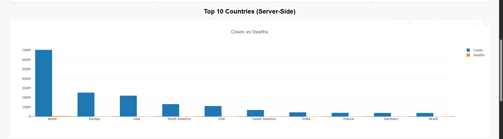

# 🦠 COVID-19 Live Data Tracker

A Django-based web application that displays real-time COVID-19 statistics scraped from [Worldometer](https://www.worldometers.info/coronavirus/). The app includes interactive visualizations using Plotly.js and Chart.js, a live search filter, and server-side caching for performance optimization. MADE BY HIMANSHU JAIN

---

## 📌 Features

- 🌐 Real-time data scraping with BeautifulSoup
- 📊 Interactive charts (Top 10 countries by cases)
- 📈 Daily trend visualization (Chart.js)
- 🔍 Search functionality to filter countries
- ⚡ Server-side caching using Django cache
- 🎨 Clean UI with responsive charts and tables

---
## 🌐 Overview of the Project
This project builds a real-time COVID-19 dashboard using:
| Layer    | Technology           | Purpose                                                                                |
| -------- | -------------------- | -------------------------------------------------------------------------------------- |
| Backend  | Django               | Server + URL routing + templates                                                       |
| Scraper  | BeautifulSoup        | Extract live data from [worldometers.info](https://www.worldometers.info/coronavirus/) |
| Caching  | Django LocMemCache   | Store scraped data for 30 minutes to reduce traffic/load                               |
| Frontend | HTML/CSS/JS          | Create UI, handle search                                                               |
| Graphs   | Plotly.js & Chart.js | Interactive bar & line charts                                                          |
| Search   | Django GET request   | Server-side filtering of countries                                                     |
-----

## 🧠 Web-Scraping Logic:
- Requests the HTML content of the COVID-19 statistics page.
- Parses it using BeautifulSoup.
- Locates the table containing country data
- Extracts the top 50 rows (countries).
- Parses text, removes commas, and converts numbers.
- Returns a list of dictionaries for each country.
----

## 🌍 Server Logic:
- Loads Django rendering functions.
- Enables caching.
- Imports scraper.
- Grabs the search keyword from the URL (like ?q=india).
- Tries to load cached data.
- If unavailable, scrapes and stores it for 30 mins.
- Filters the data server-side based on the search query.
- Gets the top 10 countries by case count.
- Sends data to the HTML template.
----
## 📈 API for Trend Chart:
- Returns a hardcoded JSON response to feed into Chart.js.
---
## 🗺 Routing:
- Maps URL / to the dashboard.
- Maps /api/trend/ to trend chart data.
----

## 🎨 HTML Template:
- Loads Django's static files (for CSS and JS).
- Includes Plotly and Chart.js.
- Simple search form (server-side).
- Dynamically prints all filtered countries’ data in a table.
- Prepares graphs.
- {{ top10|safe }} passes data to JS.
------

## 📊 FrontEnd Graph Logic:
- Plots top 10 countries using Plotly.
- Loads daily case trend data from the backend and plots it with Chart.js.


## ✅ Server-Side Benefits
-------------------------------------------------
  Feature	                        Implemented Using
- Search filter (country) -->	    Django GET handler
- Bar graphs (top countries) -->	 Server-supplied JSON
- Trend data -->	                Django REST-style view
- Scraping & caching -->	         Django + BeautifulSoup
---
## 🚀 Technologies Used

| Stack        | Tools                           |
|--------------|---------------------------------|
| Backend      | Django, Python, BeautifulSoup   |
| Frontend     | HTML, CSS, Plotly.js, Chart.js  |
| Caching      | Django LocMemCache              |
| Data Source  | https://www.worldometers.info/coronavirus/ |

---

## 🛠️ Installation & Run Locally

### 1. Clone the Repository

```bash
git clone https://github.com/YOUR_USERNAME/covid19-tracker.git
cd covid19-tracker
```

### 2. Create Virtual Environment (MANDATORY)

```bash
python -m venv .venv
source .venv/bin/activate      # For Linux/macOS
.venv\Scripts\activate       # For Windows
```

### 3. Install Dependencies

```bash
pip install -r requirements.txt
pip install django beautifulsoup4 requests

```

### 4. Run Server

```bash
python manage.py runserver
```

Now open your browser and visit: [http://127.0.0.1:8000/](http://127.0.0.1:8000/)

---

## 📂 Project Structure

```
covid_tracker/
├── covid_app/
│   ├── scraper.py
│   ├── views.py
│   ├── api.py
│   ├── templates/
│   │   └── dashboard.html
│   ├── static/
│       ├── style.css
│       └── scripts.js
├── covid_tracker/
│   ├── settings.py
│   ├── urls.py
├── manage.py
└── requirements.txt
```

---

## 📸 Screenshots



---

## 📤 Deployment (Optional)

To deploy on **Render**, follow these steps:

1. Commit and push code to GitHub (instructions below).
2. Go to [https://render.com](https://render.com) → New Web Service.
3. Connect your GitHub → select repo → set build command:
   ```bash
   pip install -r requirements.txt && python manage.py migrate && python manage.py collectstatic --noinput
   ```
4. Start command:
   ```bash
   gunicorn covid_tracker.wsgi
   ```

---

## 🧾 License

This project is licensed under the MIT License.

---
🎯 What You’ve Achieved:
 ✅ Live COVID-19 data scraping
 ✅ Server-side search filter
 ✅ Data caching (faster + reliable)
 ✅ Plotly bar chart (Top 10 countries)
 ✅ Chart.js line chart (trends)
 ✅ Static files and Django templating
 ✅ Modular & scalable architecture

## 🙌 Acknowledgments

- Data Source: [Worldometers](https://www.worldometers.info/coronavirus/)
- Django Project Starter Template
